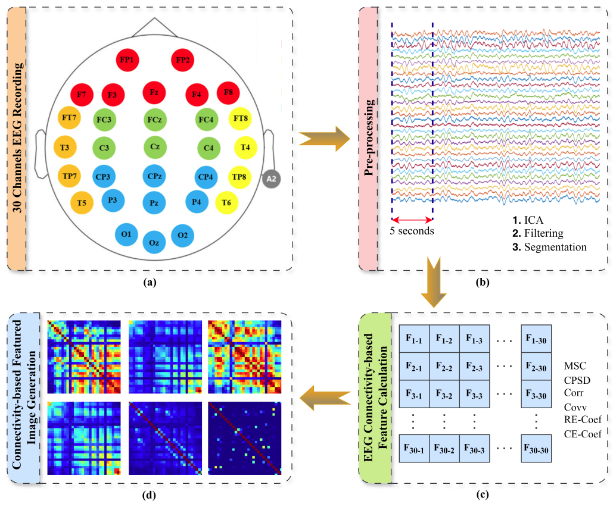
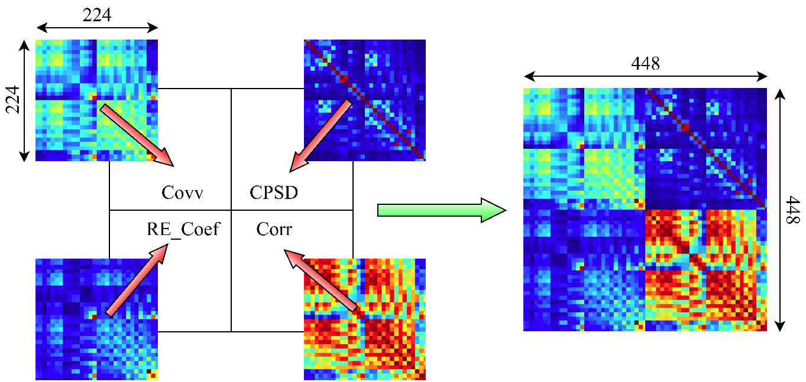
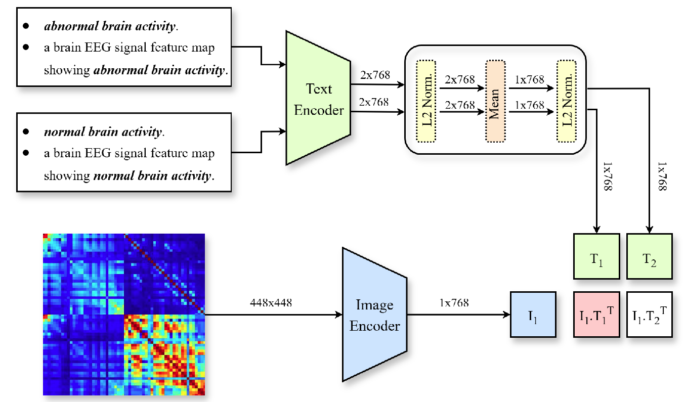
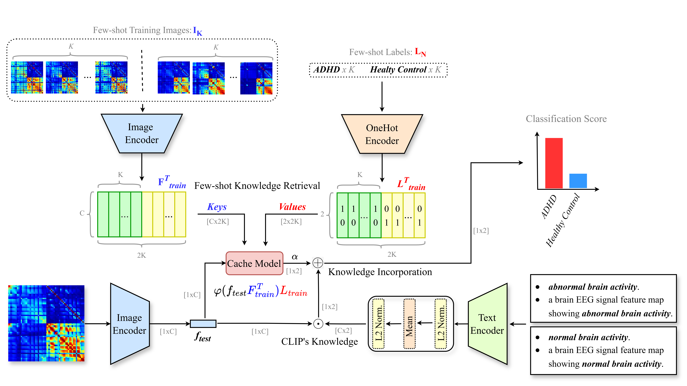
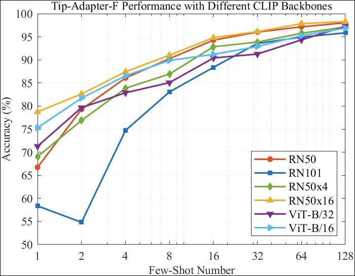

# Vision-Language Model for Few-Shot ADHD Classification using EEG


Official implementation of **"Vision-Language Model Approach for Few-Shot Learning of Attention Deficit Hyperactivity Disorder Using EEG Connectivity-Based Featured Images"** published in *Machine Learning: Science and Technology* (2025).

**Authors:** Mehmet Sergen Catal, Abdurrahman Gumus, Ozlem Karabiber Cura, Ocan Aydin, Mehmet Zübeyir Ünlü

---

## Abstract

Traditional medical diagnosis approaches have predominantly relied on single-modality analysis, limiting clinicians to interpreting isolated data streams such as images or time series. The integration of vision language models (VLMs) into neurophysiological analysis represents a paradigm shift toward multimodal diagnostic frameworks, enabling clinicians to interact with diagnosis models through diverse modalities including text, audio, visual inputs, etc. 

This study explores the application of VLMs to electroencephalography (EEG)-based attention deficit hyperactivity disorder (ADHD) classification, addressing a gap in neurophysiological diagnostics. The proposed framework applies VLM-based few-shot ADHD classification by converting raw EEG data into EEG connectivity-based featured images compatible with contrastive language-image pre-training's (CLIP) image encoder. The adaptor-based CLIP approach (Tip-Adapter and Tip-Adapter-F) for few-shot learning improves CLIP's zero-shot classification performance, achieving **78.73% accuracy with 1-shot** and **98.30% accuracy with 128-shot** using the RN50x16 backbone.

Through the adaptation of pre-trained VLMs to neurophysiological data, this technique demonstrates the potential for multimodal diagnostic frameworks that enable flexible clinician-model interactions beyond conventional label-based classification systems.

---

## Key Highlights

- **Novel VLM Application**: First application of Vision-Language Models to EEG-based ADHD classification.
- **Few-Shot Learning**: Achieves high accuracy with minimal training data (8.73% accuracy with 1-shot and 98.30% accuracy with 128-shot).
- **EEG Connectivity Features**: Utilizes 6 connectivity metrics (MSC, CPSD, Corr, Covv, RE-Coef, CE-Coef).
- **Multimodal Interaction**: Enables flexible clinician-model interaction through natural language prompts.
- **Clinical Efficiency**: Reduces extensive EEG data collection requirements while maintaining high diagnostic accuracy.
- **Data Quality Focus**: Demonstrates that data quality matters more than quantity for VLMs.

---

## Methodology

The framework consists of three main stages:

### 1. EEG Connectivity-Based Featured Image Generation

- Raw EEG signals (30 channels, 1 kHz sampling) are preprocessed using ICA and band-pass filtering (0.5-48 Hz).
- Six connectivity features are computed for all channel pairs:
  - **MSC** (Magnitude Squared Coherence)
  - **CPSD** (Cross-Power Spectral Density)
  - **Corr** (Correlation Coefficient)
  - **Covv** (Covariance)
  - **RE-Coef** (Cohentropy Coefficient)
  - **CE-Coef** (Correntropy Coefficient)
- Connectivity matrices (30×30) are converted to 224×224 images using jet colormap.

- Four features are combined into 448×448 featured images.

### 2. CLIP-Based Vision-Language Model

- Pre-trained CLIP model processes images and text descriptions simultaneously.
- Image encoder: Processes images. 
- Text encoder: Processes natural language class descriptions.
- Classification via cosine similarity between image and text embeddings.

### 3. Few-Shot Adaptation

- **Tip-Adapter**: Training-free adaptation using key-value cache mechanism.
- **Tip-Adapter-F**: Fine-tuned variant with learnable cache keys.
- Hyperparameters optimized via grid search (α: residual ratio, β: affinity sharpness.)


## Main Results

### Few-Shot Classification Performance with IKCU ADHD Dataset (RN50x16 Backbone)

| Method | Few-Shot Configuration | Accuracy |
|--------|------------------------|----------|
| Zero-Shot CLIP | 0-shot | 54.98% |
| Tip-Adapter-F | 1-shot | **78.73%** |
| Tip-Adapter-F | 2-shot | 82.61% |
| Tip-Adapter-F | 4-shot | 87.41% |
| Tip-Adapter-F | 8-shot | 91.02% |
| Tip-Adapter-F | 16-shot | 94.80% |
| Tip-Adapter-F | 32-shot | 96.12% |
| Tip-Adapter-F | 64-shot | 97.84% |
| Tip-Adapter-F | 128-shot | **98.30%** |

### Key Experimental Findings

#### 1. Prompt Engineering Effects
- Simple prompts outperformed detailed clinical descriptions
- Multiple prompts improved performance over single prompts

#### 2. Backbone Architecture Comparison

- **RN50x16**: Best overall performance across all shot configurations (768-dim embeddings)

### 3. EEG Feature Combination Analysis
- **Best Combination**: Covv + RE-Coef + CPSD + Corr → **94.80% accuracy** (16-shot)
- **Individual Feature Impact**:
  - Covariance (Covv): +2.50% average improvement
  - Correlation (Corr): +1.50% average improvement
  - CPSD: +0.82% average improvement
  - RE-Coef: +0.79% average improvement

#
#### 4. Patient-Based Classification
- Demonstrates strong generalization to completely unseen patients
- 79.58% accuracy with 1-shot patient-based split
- 89.17% accuracy with 32-shot patient-based split

#### 5. Data Quality vs. Quantity Analysis

| Dataset | Subjects | Channels | Sampling | Paradigm | 128-Shot Accuracy |
|---------|----------|----------|----------|----------|-------------------|
| **IKCU ADHD** | 15 ADHD, 18 HC | 30 | 1 kHz | Resting-state | **98.30%** |
| **Public Dataset** | 61 ADHD, 60 HC | 19 | 128 Hz | Task-based | 68.36% |

**Critical Finding**: Higher quality data (more channels, higher sampling rate, resting-state) significantly outperforms larger datasets with lower quality, demonstrating that **data quality matters more than quantity** for VLM-based approaches.

---

## Getting Started

### Prerequisites

```bash
Python >= 3.8
PyTorch >= 2.7.1
CUDA-capable GPU (recommended: NVIDIA RTX 4090 or similar)
```

### Installation

```bash
# Clone the repository
git clone https://github.com/miralab-ai/vlm-few-shot-eeg.git
cd vlm-few-shot-eeg

# Create virtual environment
conda create -n vlm-few-shot-eeg python=3.8
conda activate vlm-few-shot-eeg

# Install dependencies
pip install -r requirements.txt
```

---

## Usage

### Dataset Preparation

**Note**: We do not share our private IKCU ADHD dataset. However, you can evaluate the framework using:
- **Public ADHD dataset**: [IEEE Dataport](https://dx.doi.org/10.21227/rzfh-zn36) (61 ADHD, 60 HC)
- **Your own EEG dataset** with connectivity-based featured images

#### Required Data Format
The code expects preprocessed EEG connectivity-based featured images in the following structure:
```
data/
  ├── eeg/ ├── 1/  # ADHD class
           │   ├── image_001.png
           │   ├── image_002.png
           │   └── ...
           └── 0/  # HC class
               ├── image_001.png
               ├── image_002.png
               └── ...
```

Each image should be a **448×448 pixel PNG file** representing combined EEG connectivity features.

**Important**: We do not provide the code for converting raw EEG to connectivity-based featured images. Users should prepare their own connectivity-based images following the methodology described in the paper (Section 2.2).

### Running the Experiments


```bash
# You should set the root path of your dataset in the configs/eeg.yaml.
root_path: 'rooth_path/of_your_data'
```

```bash
# You should set the few-shot number in configs/eeg.yaml. And change the following line accoring the few-shot number in datasets/eeg.py.
...
class EEG(DatasetBase):
    dataset_dir = 'eeg'

    def __init__(self, root, num_shots):
        self.dataset_dir = os.path.join(root, self.dataset_dir)
        self.image_dir = os.path.join(self.dataset_dir)
        self.split_path = os.path.join(self.dataset_dir, 'split_eeg_16shot.json')  # Change filename to indicate shots
        self.template = template

        if not os.path.exists(self.split_path):

            # Set a random seed based on current timeS
            random.seed()  # This uses system time as seed

            train, val, test = self._create_split(num_shots = 16)  # Change shot number here
            write_json({'train': train, 'val': val, 'test': test}, self.split_path)
            print(f"Created new split file: {self.split_path}")
...
```

#### Basic Usage
```bash
# Run with default configuration
python vlm-few-shot-eeg.py --config configs/eeg.yaml
```

---

## Repository Structure

```
vlm-few-shot-eeg/
├── configs/
│   └── eeg.yaml                # Configuration file
├── clip/
│   ├── clip.py
│   ├── __init__.py         
│   ├── bpe_simple_vocab_16e6.txt.gz
|   ├── simple_tokenizer.py          
│   └── model.py         
├── dataset/
│   ├── eeg.py                  
│   ├── __init__.py  
│   ├── oxford_pets.py
│   └── utils.py      
├── data/                       # Place your connectivity-based images here
│   ├── eeg/ ├── 1/             # ADHD class
│            └── 0/             # HC class
├── vlm-few-shot-eeg.py         # Main execution script
|── util.py
|── main.py
├── requirements.txt
├── README.md
└── 
```
---
## Reproducibility

To reproduce the results from the paper:

1. **Prepare your EEG connectivity-based featured images** (448×448 PNG format) following the methodology in Section 2.2 of the paper
2. **Configure the dataset path** in `configs/eeg.yaml`
3. **Run the experiments**:
   ```bash
   # Full experiment suite
   python vlm-few-shot-eeg.py --config configs/eeg.yaml
   ```

**Note**: Exact reproduction of paper results requires the IKCU ADHD dataset (not publicly available). However, the methodology can be applied to:
- The public dataset from [IEEE Dataport](https://dx.doi.org/10.21227/rzfh-zn36)
- Your own EEG dataset with appropriate preprocessing

---

## Citation

If you use this code or find our work helpful, please cite our paper:

```bibtex
@article{catal2025vision,
  title={Vision-Language Model Approach for Few-Shot Learning of Attention Deficit Hyperactivity Disorder Using EEG Connectivity-Based Featured Images},
  author={Catal, Mehmet Sergen and Gumus, Abdurrahman and Cura, Ozlem Karabiber and Aydin, Ocan and Unlu, Mehmet Zubeyir},
  journal={Machine Learning: Science and Technology},
  volume={10},
  pages={015005},
  year={2025},
  publisher={IOP Publishing},
  doi={10.1088/2632-2153/ae15e5}
}
```

---

## Conclusion

This study presents a novel integration of Vision-Language Models into neurophysiological diagnostics, specifically for ADHD classification using EEG data. The key contributions and outcomes include:

### Major Achievements:
1. **Cross-Modal Transfer Learning**: Successfully adapted pre-trained VLMs (CLIP) to neurophysiological domain, demonstrating effective transfer learning from vision-language to EEG-based classification.

2. **Few-Shot Performance**: Achieved 98.30% accuracy with 128-shot learning and 78.73% with just 1-shot, significantly reducing the need for extensive labeled EEG data collection.

3. **Data Quality Insights**: Demonstrated that high-quality EEG data (higher sampling rate, more channels, resting-state paradigm) significantly outperforms larger datasets with lower quality - a critical finding for clinical implementation.

4. **Multimodal Diagnostic Framework**: Established foundations for flexible clinician-model interaction through natural language prompts, moving beyond conventional label-based classification systems.

5. **Practical Clinical Applicability**: The framework's ability to achieve >90% accuracy with just 8 examples per class makes it particularly suitable for clinical settings where large training datasets are often unavailable.

### Clinical Implications:
- Reduces time and resources required for EEG data collection
- Enables rapid diagnostic model development with minimal labeled examples
- Provides interpretable interaction through natural language descriptions
- Demonstrates robust generalization to unseen patients

### Future Directions:
- Extension to other neurological and psychiatric disorders
- Investigation of multi-disorder classification frameworks
- Integration of additional modalities (fMRI, MEG, clinical notes)
- Real-time clinical deployment and validation studies
- Exploration of more sophisticated prompt engineering techniques incorporating domain-specific knowledge

This work opens new possibilities for leveraging large-scale pre-trained models in clinical neuroscience, potentially transforming diagnostic workflows through multimodal, data-efficient approaches.

---

## Authors & Affiliations

- **Mehmet Sergen Catal** - Department of Electrical and Electronics Engineering, Izmir Institute of Technology, Türkiye
- **Abdurrahman Gumus** - Department of Computer Engineering, Isparta University of Applied Sciences, Türkiye
- **Ozlem Karabiber Cura** - Department of Biomedical Engineering, Izmir Katip Celebi University, Türkiye
- **Ocan Aydin** - Department of Electrical and Electronics Engineering, Izmir Institute of Technology, Türkiye
- **Mehmet Zübeyir Ünlü** - Department of Electrical and Electronics Engineering, Izmir Institute of Technology, Türkiye

## Contact

For questions, collaborations, or issues:
- **Abdurrahman Gumus**: abdurrahmangumus@isparta.edu.tr
- **Ozlem Karabiber Cura**: ozlem.karabiber@ikcu.edu.tr

---

## Acknowledgments

- EEG data collection was approved by the Izmir Katip Celebi University Non-Invasive Clinical Research Ethics Committee (Decision No. 76, dated July 11, 2019).
- We thank OpenAI for making CLIP models publicly available.
- Built upon the [Tip-Adapter](https://github.com/gaopengcuhk/Tip-Adapter) framework by Zhang et al.
- Public ADHD/HC EEG dataset provided by Motie Nasrabadi et al. via [IEEE Dataport](https://dx.doi.org/10.21227/rzfh-zn36)

---

## References & Related Work

### Primary References
- **CLIP**: [Learning Transferable Visual Models From Natural Language Supervision](https://arxiv.org/abs/2103.00020) - Radford et al., ICML 2021
- **Tip-Adapter**: [Training-free Adaption of CLIP for Few-shot Classification](https://arxiv.org/abs/2207.09519) - Zhang et al., ECCV 2022

### Public Dataset
- Motie Nasrabadi et al., "EEG Data for ADHD/Control Children" - [IEEE Dataport](https://dx.doi.org/10.21227/rzfh-zn36)

### Useful Links
- [Our paper (IOP Publishing)](https://doi.org/10.1088/2632-2153/ae15e5)
- [CLIP Official Repository](https://github.com/openai/CLIP)
- [Tip-Adapter Official Repository](https://github.com/gaopengcuhk/Tip-Adapter)

---


